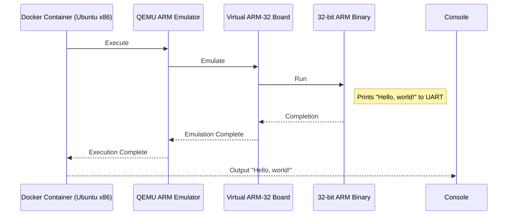

# Dockerized ARM Assembly Hello World

This Dockerfile sets up an environment for ARM assembly development and includes an example program (`hello.s`) that prints "Hello, world!" over UART.

## Prerequisites

- [Docker](https://www.docker.com/get-started)

## Build and Run

To build and run the Docker container for emulating ARM-32 execution using QEMU, follow these steps:

1. Clone this repository:

    ```shell
    git clone https://github.com/considerable/docker-qemu-arm-32.git
    cd docker-qemu-arm-32
    ```

2. Build the Docker image:

    ```shell
    docker build -t qemu-arm-32 .
    ```

3. Run the Docker container:

    ```shell
    docker run --rm qemu-arm-32
    ```

This will start the container and execute the ARM assembly program, emulating an ARM-32 board and printing "Hello, world!" to the console.

## Dockerfile Explanation

The Dockerfile sets up an environment for emulating ARM-32 execution by:

- Using an Ubuntu 22.04 base image.
- Installing QEMU and ARM assembly tools.
- Copying the `hello.s` assembly source code.
- Building the source into an ARM binary.
- Creating a 64MB image (`flash.img`) and embedding the binary.
- Running QEMU with the ARM machine to execute the program.

You can find more details in the [Dockerfile](Dockerfile) provided.

## Mermaid Diagram

The following diagram shows the flow of execution from the Docker container to the ARM-32 board:



## Assembly Code Explanation

The provided `hello.s` assembly code does the following:

- Loads the UART base address.
- Loads a pointer to the message to be printed.
- Initializes a loop counter.
- In a loop, it loads a byte from the message and writes it to the UART data register.
- Continues until the end of the message is reached.
- The message to be printed is "Hello, world!".

You can find more details in the [hello.s](hello.s) source code file.

## Acknowledgements

This project is based on the article [Hello world in ARM assembly](https://lcvisser.github.io/arm/2021/05/23/hello-world-arm-assembly.html) by L.C. Visser. Special thanks to the author for providing the source code and explanation of the hello world program in ARM assembly.
